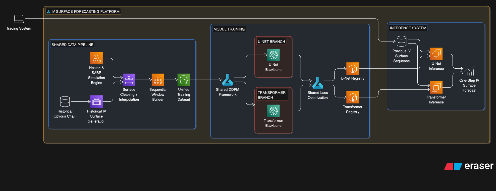

# Implied Volatility Diffusion

`implied-volatility-diffusion` is a research codebase for building, validating, and modeling implied-volatility surfaces (IVS) primarily using diffusion models.

## Quick Start

### 1) Install dependencies

With [uv](https://github.com/astral-sh/uv):

```bash
uv sync
```

For notebook workflows:

```bash
uv sync --group notebooks
```

### 2) Run tests

```bash
uv run pytest
```

### 3) Run pre-commit checks

```bash
uv run pre-commit run --all-files
```

## Project Layout

- `src/implied_volatility_diffusion/`: package code (models, pricing, synthetic surfaces, data utilities).
- `config/`: YAML configs for synthetic surface generation and shared grids.
- `notebooks/`: exploratory and reproducible research notebooks.
- `data/`: raw and processed datasets.
- `docs/`: focused technical documentation.

## System architecture

[](assets/syst_diag.svg)

## Configuration

- `[config/heston_iv_surface.yaml](config/heston_iv_surface.yaml)`: Heston market assumptions, parameter ranges, LHS, COS settings, and IV inversion settings.
- `[config/sabr_iv_surface.yaml](config/sabr_iv_surface.yaml)`: SABR market assumptions, parameter ranges, LHS, and grid settings.
- `[config/iv_surface_grid.yaml](config/iv_surface_grid.yaml)`: shared moneyness/maturity grid and plotting defaults.

## Documentation

- `[docs/heston_surface_generation.md](docs/heston_surface_generation.md)`: Heston synthetic IV surface generation flow and outputs.
- `[docs/sabr_surface_generation.md](docs/sabr_surface_generation.md)`: SABR baseline generation and calibration flow.
- `[docs/option_data_pipeline.md](docs/option_data_pipeline.md)`: historical option-data ingestion, cleaning, and feature engineering pipeline.
- `[docs/sabr_interpolation.md](docs/sabr_interpolation.md)`: SABR interpolation walkthrough on market data.
